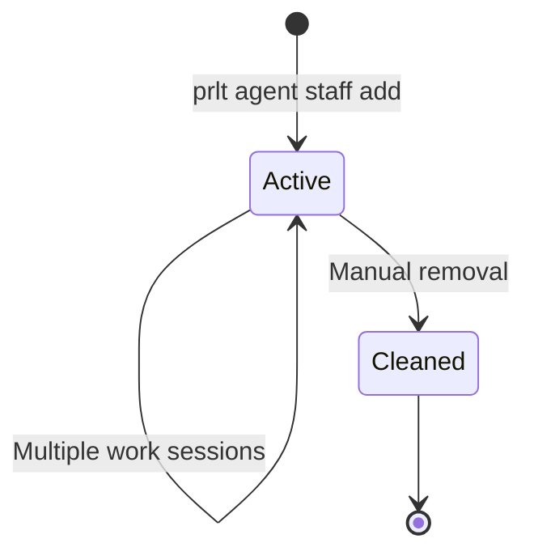
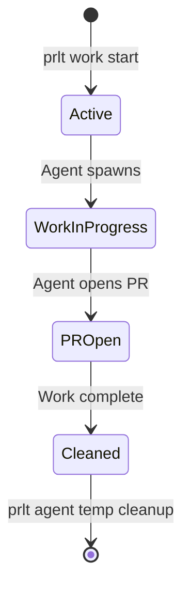

Proletariat supports two types of agents: **staff** (persistent) and **temp** (ephemeral). Both types can work in parallel, but they serve different purposes.

## Agent Types

### Staff Agents (Persistent)

Named agents that persist across work sessions. They have:

- Stable, memorable names (e.g., `musk`, `gates`, `bezos`)
- Persistent workspace in `agents/staff/{name}/`
- Database record with `type: 'persistent'`
- Long-lived git branches (e.g., `agent-musk`)

**Use staff agents for:**

- Long-running projects
- Experimentation and testing
- Agents that need consistent identity
- Work that spans multiple tickets

**Creating staff agents:**

```bash
# Add one or more staff agents
prlt agent staff add musk gates bezos

# List staff agents
prlt agent staff list

# View agent details
prlt agent status musk
```

### Temp Agents (Ephemeral)

Auto-generated agents for individual tickets. They have:

- Generated names like `bold-bezos-1`, `keen-camry-2`
- Workspace in `agents/temp/{name}/`
- Database record with `type: 'ephemeral'`
- Feature branches tied to tickets (e.g., `feat/TKT-042-oauth`)

**Use temp agents for:**

- Feature development
- Bug fixes
- One-off tasks
- Parallel work on multiple tickets

**Creating temp agents:**

```bash
# Spawn work (creates temp agent automatically)
prlt work start TKT-042
# Agent: bold-bezos-1
# Branch: feat/TKT-042-oauth

# List temp agents
prlt agent temp list

# Cleanup completed temp agents
prlt agent temp cleanup
```

<Note>
Temp agents are marked as `cleaned` in the database after work completes, but the record is kept for history.
</Note>

## Agent Schema

```typescript
export const agents = sqliteTable('agents', {
  name: text('name').primaryKey(),
  type: text('type', { enum: ['persistent', 'ephemeral'] }).notNull().default('persistent'),
  status: text('status', { enum: ['active', 'cleaned'] }).notNull().default('active'),
  baseName: text('base_name'),                // Theme name (e.g., "bezos" from "bold-bezos-1")
  themeId: text('theme_id'),
  worktreePath: text('worktree_path'),        // e.g., "agents/temp/bold-bezos-1"
  mountMode: text('mount_mode', { enum: ['worktree', 'clone'] }).notNull().default('worktree'),
  createdAt: text('created_at').notNull(),
  cleanedAt: text('cleaned_at'),
})
```

## Agent Naming Themes

Themes control how agents are named. Staff agents use theme names directly. Ephemeral agents add an adjective prefix.

### Built-in Themes

| Theme | Description | Staff Names | Ephemeral Names |
|-------|-------------|-------------|------------------|
| `billionaires` | Tech founders (default) | `musk`, `gates`, `bezos` | `bold-musk-1`, `keen-gates-2` |
| `toyotas` | Toyota vehicle models | `camry`, `supra`, `tacoma` | `bold-camry-1`, `keen-tacoma-2` |
| `companies` | Major tech companies | `stripe`, `vercel`, `linear` | `bold-stripe-1`, `keen-vercel-2` |

<Info>
**billionaires** — Finally, they work for us.
</Info>

### Theme Schema

```typescript
export const agentThemes = sqliteTable('agent_themes', {
  id: text('id').primaryKey(),
  name: text('name').notNull().unique(),
  displayName: text('display_name').notNull(),
  description: text('description'),
  builtin: integer('builtin', { mode: 'boolean' }).default(false),
  createdAt: text('created_at').notNull(),
})

export const agentThemeNames = sqliteTable('agent_theme_names', {
  themeId: text('theme_id').notNull(),
  name: text('name').notNull(),
  // PRIMARY KEY (theme_id, name)
})
```

### Theme Commands

```bash
# List available themes
prlt agent themes list

# Set active theme
prlt agent themes set toyotas

# Create custom theme
prlt agent themes create mytheme --display-name "My Theme"

# Add names to theme
prlt agent themes add-names mytheme
? Enter names (comma-separated): alpha,beta,gamma,delta
```

### Custom Themes

Create your own naming schemes:

```bash
prlt agent themes create greek --display-name "Greek Letters"
prlt agent themes add-names greek
? Enter names: alpha,beta,gamma,delta,epsilon

prlt agent themes set greek

# Now staff agents can be: alpha, beta, gamma
# Temp agents: bold-alpha-1, keen-beta-2
```

### Theme Auto-Detection

If no theme is explicitly set, Proletariat auto-detects from existing agents:

```typescript
// From database/index.ts
export function getActiveTheme(workspacePath: string): AgentTheme | null {
  const config = getWorkspaceConfig(workspacePath)
  
  // If explicitly set, use that
  if (config?.active_theme_id) {
    return getTheme(workspacePath, config.active_theme_id)
  }
  
  // Auto-detect from existing agents
  const agents = getWorkspaceAgents(workspacePath)
  // ... checks agent names against known themes
}
```

## Agent Workspaces

Each agent gets its own workspace with copies of all repositories:

```
agents/staff/musk/
├── frontend/          # Git worktree on branch: agent-musk
├── backend/
└── infra/

agents/temp/bold-bezos-1/
├── frontend/          # Git worktree on branch: feat/TKT-042-oauth
├── backend/
└── infra/
```

### Worktree Tracking

```typescript
export const agentWorktrees = sqliteTable('agent_worktrees', {
  agentName: text('agent_name').notNull(),
  repoName: text('repo_name').notNull(),
  worktreePath: text('worktree_path').notNull(),
  branch: text('branch').notNull(),
  createdAt: text('created_at').notNull(),
  lastCommitHash: text('last_commit_hash'),
  commitsAhead: integer('commits_ahead').notNull().default(0),
  isClean: integer('is_clean', { mode: 'boolean' }).notNull().default(true),
  lastChecked: text('last_checked'),
})
```

**Query agent worktrees:**

```bash
prlt agent status musk

Agent: musk (staff)
Status: active
Theme: billionaires
Branch: agent-musk

Worktrees:
  frontend  →  agents/staff/musk/frontend  (3 commits ahead, clean)
  backend   →  agents/staff/musk/backend   (1 commit ahead, dirty)
  infra     →  agents/staff/musk/infra     (up to date, clean)
```

## Mount Modes

Agents support two mount modes:

### `worktree` (Default)

Uses **git worktrees** to create isolated copies without duplicating `.git`:

- Fast workspace creation
- Shared git objects and history
- Each agent on a different branch
- No merge conflicts

```bash
prlt agent staff add musk --mount-mode worktree
```

### `clone`

Creates **independent clones** with separate `.git` directories:

- Full isolation
- No shared state
- Use when worktrees don't work well (rare)

```bash
prlt agent staff add gates --mount-mode clone
```

<Warning>
`clone` mode uses more disk space and is slower. Only use if `worktree` mode causes issues.
</Warning>

## Agent Lifecycle

### Staff Agent Lifecycle



### Temp Agent Lifecycle



## Agent Operations

### Shell into Agent

Access agent workspace directly:

```bash
prlt agent shell musk
# Opens shell in agents/staff/musk/

# Navigate to repos
cd frontend/
git status
```

### Visit Agent Workspace

Open agent directory in your file explorer:

```bash
prlt agent visit musk
# macOS: opens Finder
# Linux: opens file manager
```

### Login to Container

If agent is running in Docker:

```bash
prlt agent login musk
# Runs: claude login inside container
```

### Rebuild Agent

Recreate agent workspace from scratch:

```bash
prlt agent rebuild musk
# Removes and recreates all worktrees
```

<Warning>
Rebuilding an agent will lose uncommitted changes. Commit or stash first.
</Warning>

### Remove Agent

Delete staff agent:

```bash
prlt agent staff remove musk
# Removes database record and workspace directory
```

Cleanup temp agents:

```bash
prlt agent temp cleanup
# Removes agents marked as 'cleaned'
# Keeps database records for history
```

## Agent Discovery

Proletariat can discover agents on disk that aren't in the database:

```typescript
// From database/index.ts
export function discoverAgentsOnDisk(workspacePath: string): DiscoverResult {
  // Scans agents/staff/ and agents/temp/
  // Registers any agents not in database
  // Reactivates cleaned agents if directory exists
  // Returns: { discovered: [...], cleaned: [...] }
}
```

```bash
prlt agent list
# Auto-discovers agents on disk
# Syncs database with filesystem
```

## Agent Assignment

Tickets can be assigned to specific agents:

```typescript
export const pmoTicketAssignments = sqliteTable('pmo_ticket_assignments', {
  ticketId: text('ticket_id').notNull(),
  agentName: text('agent_name').notNull(),
  assignedAt: text('assigned_at').default(sql`CURRENT_TIMESTAMP`),
})
```

```bash
# Assign ticket to staff agent
prlt ticket edit TKT-042 --assignee musk

# Start work with specific agent
prlt work start TKT-042 --agent musk
```

## Parallel Agents

Run multiple agents simultaneously:

```bash
# Spawn multiple tickets
prlt work spawn TKT-042 TKT-043 TKT-044

# Each gets its own temp agent:
# - bold-bezos-1  → TKT-042
# - keen-gates-2  → TKT-043
# - calm-musk-3   → TKT-044
```

Each agent:

- Works in isolated workspace
- On separate git branch
- No conflicts with other agents
- Can run in Docker or host mode

**Monitor running agents:**

```bash
prlt execution list

Running Executions:
  bold-bezos-1   TKT-042  Docker  Terminal   Running (5m)
  keen-gates-2   TKT-043  Host    Background Running (3m)
  calm-musk-3    TKT-044  Docker  Background Running (1m)
```

## Key Patterns

### Case-Insensitive Names

Agent names are compared case-insensitively:

```sql
SELECT name FROM agents WHERE LOWER(name) = LOWER(?)
```

You can't have both `Musk` and `musk` as separate agents.

### Ephemeral Name Generation

Temp agents use this pattern:

```typescript
// adjective + base-name + number
// e.g., bold-bezos-1, keen-camry-2

function isEphemeralAgentName(name: string): boolean {
  // Checks for adjective-name pattern
  // or adjective-name-number pattern
}
```

### Agent Status

Agents can be:

- **active**: Currently in use or available
- **cleaned**: Removed from disk but kept in database for history

```typescript
db.prepare(
  "UPDATE agents SET status = 'cleaned', cleaned_at = ? WHERE name = ?"
).run(now, agentName)
```

Queries exclude cleaned agents by default:

```typescript
SELECT * FROM agents WHERE status = 'active' OR status IS NULL
```

## Summary

<CardGroup cols={2}>
  <Card title="Staff Agents" icon="user">
    Persistent, named agents for long-running work
  </Card>
  
  <Card title="Temp Agents" icon="user-clock">
    Ephemeral agents auto-created for tickets
  </Card>
  
  <Card title="Naming Themes" icon="palette">
    Built-in and custom themes for consistent naming
  </Card>
  
  <Card title="Worktrees" icon="code-branch">
    Isolated git branches without duplicating .git
  </Card>
  
  <Card title="Mount Modes" icon="link">
    Choose worktree (fast) or clone (full isolation)
  </Card>
  
  <Card title="Parallel Work" icon="layer-group">
    Run multiple agents simultaneously without conflicts
  </Card>
</CardGroup>

## Next Steps

- [Execution Modes](/concepts/execution-modes) - Docker vs Host, Terminal vs Background
- [Workflows](/concepts/workflows) - Customize ticket status flows
- [Workspace](/concepts/workspace) - Deep dive into directory structure
