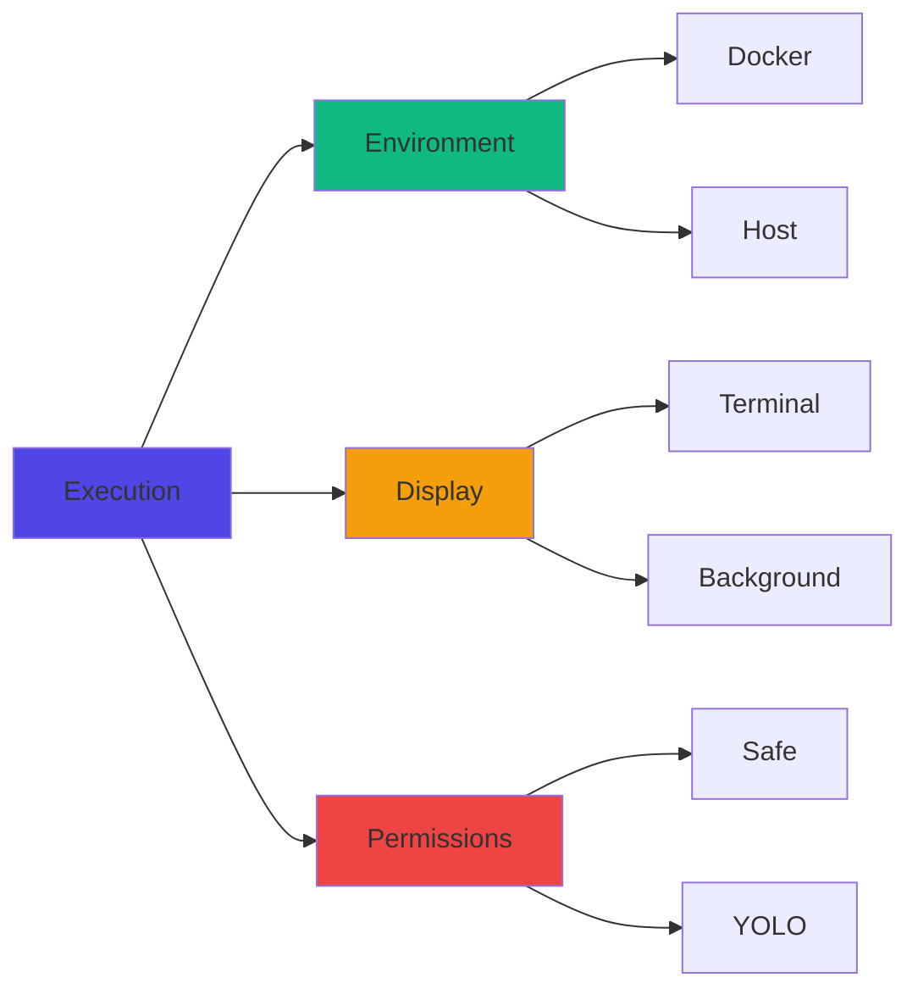

Proletariat supports multiple execution modes that control **where** agents run, **how** you see them, and **what permissions** they have. Understanding these modes helps you balance safety, speed, and convenience.

## The Three Dimensions

Every agent execution has three configuration dimensions:



## Environment: Where Agents Run

### Docker (Isolated)

Agent runs inside a **Docker container**:

- Fully isolated from your host machine
- Uses your repository's `.devcontainer` configuration
- Safe for untrusted code or aggressive autonomy
- Slightly slower due to container overhead

**Use Docker when:**

- You want maximum safety
- Running YOLO mode (full autonomy)
- Working with untrusted code
- Using agents for experimental features

```bash
# Docker is default if devcontainer exists
prlt work start TKT-042

# Explicitly use Docker
prlt work start TKT-042 --mode docker
```

### Host (Fast)

Agent runs directly on your **host machine**:

- No container overhead—fastest option
- Direct access to your file system
- No isolation—agent can access anything you can
- Requires Claude Code installed locally

**Use Host when:**

- You need maximum speed
- Working on trusted code
- Running in Safe mode with permission prompts
- No devcontainer available

```bash
# Run on host
prlt work start TKT-042 --run-on-host

# Alternative flag
prlt work start TKT-042 --mode host
```

<Warning>
Host mode gives agents full access to your machine. Always use Safe mode (default) unless you trust the code.
</Warning>

### Environment Detection

```typescript
// From execution/config.ts
export async function resolveEnvironment(
  options: { environment?: Environment; devcontainerPath?: string }
): Promise<Environment> {
  if (options.environment) return options.environment
  
  // Auto-detect: use Docker if devcontainer exists
  if (options.devcontainerPath && fs.existsSync(options.devcontainerPath)) {
    return 'docker'
  }
  
  return 'host'
}
```

## Display: How You See Agents

### Terminal (Interactive)

Opens a **new terminal tab** attached to the agent:

- Watch agent work in real-time
- See Claude Code UI with streaming output
- Interact with prompts if needed
- Terminal tab stays open until agent finishes

**Use Terminal when:**

- You want to watch the agent work
- Debugging or learning
- Short-lived tasks
- Need to intervene manually

```bash
# Terminal is default
prlt work start TKT-042

# Explicitly set terminal
prlt work start TKT-042 --display terminal
```

### Background (Detached)

Agent runs **headlessly** in a tmux session:

- No terminal window opens
- Agent works silently in background
- Reattach anytime to see progress
- Perfect for long-running tasks

**Use Background when:**

- Working on multiple tickets in parallel
- Long-running tasks (hours)
- You don't need to watch
- Running from CI/CD or scripts

```bash
# Background mode
prlt work start TKT-042 --display background

# Reattach to see progress
prlt execution logs <execution-id>
```

<Info>
All executions run inside **tmux sessions** under the hood, even in Terminal mode. Close the window—the agent keeps working.
</Info>

### Display Modes in Schema

```typescript
// From execution/types.ts
export type DisplayMode = 'terminal' | 'background' | 'foreground'

// From drizzle-schema.ts
export const pmoAgentWork = sqliteTable('agent_work', {
  id: text('id').primaryKey(),
  displayMode: text('display_mode').notNull().default('terminal'),
  // ...
})
```

## Permissions: What Agents Can Do

### Safe (Prompted)

Agent **asks for permission** before destructive operations:

- File writes, deletions, renames
- Command executions
- Network requests
- Git operations (push, force push, etc.)

**Use Safe when:**

- Running on host (no isolation)
- First time with new code
- Untrusted or experimental agents
- Want manual control

```bash
# Safe is default
prlt work start TKT-042

# Explicitly set safe mode
prlt work start TKT-042 --mode safe
```

### YOLO (Full Autonomy)

Agent runs with **full permissions**, no prompts:

- Complete autonomy
- No interruptions
- Fast, unattended execution
- **Only safe in Docker** (isolated)

**Use YOLO when:**

- Running in Docker (isolated)
- Trusted code and agent behavior
- Batch processing multiple tickets
- Unattended execution (CI/CD)

```bash
# YOLO mode (full autonomy)
prlt work start TKT-042 --skip-permissions

# YOLO + Docker = safe autonomy
prlt work start TKT-042 --mode docker --skip-permissions
```

<Warning>
**Never use YOLO on host** unless you fully trust the code. Agents can modify or delete any file you have access to.
</Warning>

### Permission Modes in Code

```typescript
// From execution/types.ts
export type PermissionMode = 'safe' | 'yolo'

// From drizzle-schema.ts
export const pmoAgentWork = sqliteTable('agent_work', {
  id: text('id').primaryKey(),
  permissionMode: text('permission_mode').notNull().default('safe'),
  // ...
})
```

## Execution Schema

```typescript
export const pmoAgentWork = sqliteTable('agent_work', {
  id: text('id').primaryKey(),
  ticketId: text('ticket_id').notNull(),
  agentName: text('agent_name').notNull(),
  executor: text('executor').notNull(),              // 'claude-code', 'opencode', etc.
  environment: text('environment').notNull().default('host'),  // 'docker' or 'host'
  displayMode: text('display_mode').notNull().default('terminal'),  // 'terminal' or 'background'
  permissionMode: text('permission_mode').notNull().default('safe'),  // 'safe' or 'yolo'
  status: text('status').notNull().default('starting'),
  branch: text('branch'),
  pid: text('pid'),
  containerId: text('container_id'),
  sessionId: text('session_id'),                     // tmux session ID
  host: text('host'),
  logPath: text('log_path'),
  startedAt: text('started_at').default(sql`CURRENT_TIMESTAMP`),
  completedAt: text('completed_at'),
  exitCode: integer('exit_code'),
})
```

## Common Patterns

### Development (Watch & Iterate)

```bash
# Default: Docker + Terminal + Safe
prlt work start TKT-042

# Watch agent work in real-time
# Agent prompts for permissions
# Container provides isolation
```

**Best for:** Learning, debugging, iterating on prompts.

### Production (Fast & Autonomous)

```bash
# Docker + Background + YOLO
prlt work start TKT-042 \
  --display background \
  --skip-permissions

# Agent works silently with full autonomy
# Container keeps it safe
# Check logs anytime: prlt execution logs <id>
```

**Best for:** Batch processing, CI/CD, unattended execution.

### Host Speed (Safe)

```bash
# Host + Terminal + Safe
prlt work start TKT-042 \
  --run-on-host \
  --display terminal

# Fastest execution (no container)
# Agent prompts for destructive ops
# You can watch and intervene
```

**Best for:** Trusted code, need speed, want to watch.

### Parallel Background

```bash
# Spawn multiple tickets in background
prlt work spawn TKT-042 TKT-043 TKT-044 \
  --display background \
  --mode docker \
  --skip-permissions

# All agents work in parallel
# No terminal windows opened
# Check progress: prlt execution list
```

**Best for:** Parallel feature development, bug bashes.

## Execution Status

Monitor running agents:

```bash
prlt execution list

Running Executions:
  ID                  Ticket   Agent          Env     Display    Status   Duration
  ──────────────────────────────────────────────────────────────────────────────────
  exec-abc123         TKT-042  bold-bezos-1   Docker  Terminal   Running  5m 23s
  exec-def456         TKT-043  keen-gates-2   Host    Background Running  3m 12s
  exec-ghi789         TKT-044  calm-musk-3    Docker  Background Running  1m 45s
```

View logs:

```bash
prlt execution logs exec-abc123

# Follows agent output in real-time
# Works for both Terminal and Background
```

Stop execution:

```bash
prlt execution stop exec-abc123

# Gracefully stops agent
# Preserves work in progress
```

## Tmux Sessions

All executions run inside **tmux sessions**:

- Session name: `prlt-{agent-name}-{timestamp}`
- Persists across terminal closes
- Can reattach manually

```bash
# List sessions
tmux ls

# Attach to session
prlt session attach prlt-bold-bezos-1-1234567890

# Or use tmux directly
tmux attach -t prlt-bold-bezos-1-1234567890
```

<Info>
Tmux sessions ensure agents keep working even if you close your terminal, restart your machine, or lose connection.
</Info>

## Docker Containers

When running in Docker, each agent gets a container:

```typescript
export const pmoContainers = sqliteTable('containers', {
  id: text('id').primaryKey(),
  agentName: text('agent_name').notNull(),
  dockerId: text('docker_id').notNull(),
  dockerName: text('docker_name'),
  image: text('image'),
  status: text('status').notNull().default('unknown'),
  currentExecutionId: text('current_execution_id'),
  createdAt: text('created_at'),
  lastSeenAt: text('last_seen_at'),
})
```

**Manage containers:**

```bash
# List containers
prlt docker list

# Shell into container
prlt docker shell bold-bezos-1

# View container logs
prlt docker logs bold-bezos-1

# Stop container
prlt docker stop bold-bezos-1

# Clean up stopped containers
prlt docker clean
```

## Watch Mode

Watch a workflow column and spawn agents automatically:

```bash
prlt work watch \
  --column "Ready" \
  --display background \
  --mode docker \
  --skip-permissions

# Monitors "Ready" column
# Spawns agents for new tickets
# All in background with full autonomy
```

**Best for:** Continuous integration, automated ticket processing.

## Key Takeaways

<CardGroup cols={2}>
  <Card title="Docker = Safety" icon="shield">
    Use Docker for isolation and YOLO mode safety
  </Card>
  
  <Card title="Host = Speed" icon="bolt">
    Use Host for fastest execution with trusted code
  </Card>
  
  <Card title="Terminal = Visibility" icon="eye">
    Use Terminal to watch and learn from agents
  </Card>
  
  <Card title="Background = Scale" icon="layer-group">
    Use Background for parallel, long-running work
  </Card>
  
  <Card title="Safe = Control" icon="hand">
    Use Safe for manual approval of destructive ops
  </Card>
  
  <Card title="YOLO = Autonomy" icon="rocket">
    Use YOLO in Docker for full unattended autonomy
  </Card>
</CardGroup>

## Decision Matrix

| Use Case | Environment | Display | Permissions | Why |
|----------|-------------|---------|-------------|-----|
| Learning / Debugging | Docker | Terminal | Safe | Watch safely, see everything |
| Trusted dev work | Host | Terminal | Safe | Fast, visible, controlled |
| Batch processing | Docker | Background | YOLO | Safe autonomy, unattended |
| Parallel features | Docker | Background | YOLO | Scale safely |
| Long-running task | Docker | Background | Safe | Safe, detached, reattachable |
| Quick fix (trusted) | Host | Terminal | Safe | Fastest, interactive |
| CI/CD automation | Docker | Background | YOLO | Fully automated, isolated |

## Next Steps

- [Workflows](/concepts/workflows) - Customize ticket status flows
- [Agents](/concepts/agents) - Staff vs temp agents
- [Workspace](/concepts/workspace) - Directory structure and database
