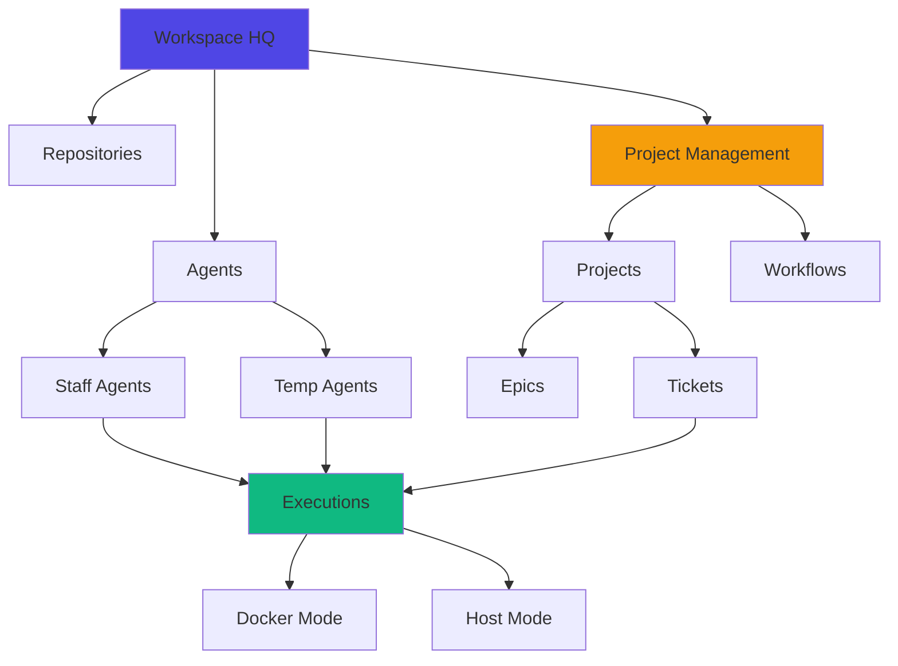

Proletariat CLI is built around a few core concepts that work together to enable scalable, isolated AI agent orchestration. Understanding these concepts will help you make the most of the platform.

## The Big Picture



## Core Concepts at a Glance

<CardGroup cols={2}>
  <Card title="Workspace" icon="building" href="/concepts/workspace">
    Your HQ directory structure with repos, agents, and SQLite database
  </Card>
  
  <Card title="Tickets & Epics" icon="ticket" href="/concepts/tickets">
    Structured work items with requirements and acceptance criteria
  </Card>
  
  <Card title="Agents" icon="robot" href="/concepts/agents">
    Staff (persistent) and temp (ephemeral) workers with themed names
  </Card>
  
  <Card title="Execution Modes" icon="gears" href="/concepts/execution-modes">
    Docker vs Host, Terminal vs Background, Safe vs YOLO
  </Card>
  
  <Card title="Workflows" icon="diagram-project" href="/concepts/workflows">
    Customizable status flows for your development process
  </Card>
</CardGroup>

## Key Principles

### Isolated Work

Each agent works in its own git branch and workspace directory. No conflicts, no race conditions. Agents can work in parallel without stepping on each other's toes.

```bash
my-project/
├── repos/              # Your source repos (main branch)
└── agents/
    ├── staff/
    │   └── musk/       # Persistent agent, branch: agent-musk
    └── temp/
        ├── bold-gates-1/   # TKT-042, branch: feat/TKT-042-oauth
        └── keen-bezos-2/   # TKT-043, branch: feat/TKT-043-api
```

### Durable Sessions

All agent executions run inside **tmux sessions** under the hood. Close your terminal window—the agent keeps working. Reattach anytime to see progress.

### Structured Context

Instead of freeform chat, agents receive **tickets** with structured requirements, acceptance criteria, affected paths, and more. Context persists across multiple runs.

### Agent-Native

Every command supports `--json` mode, making it easy for AI agents to drive the CLI programmatically. The MCP server exposes 100+ tools for seamless integration.

## Data Model

All state lives in a single SQLite database at `.proletariat/workspace.db`:

```
Workspace (HQ)
├── Projects
│   ├── Epics → Tickets
│   └── References a Workflow
├── Workflows → Phases → Statuses
├── Specs (can span projects)
├── Actions (reusable templates)
├── Agents
│   ├── Staff (persistent, named)
│   └── Temp (ephemeral, per-ticket)
└── Executions (running sessions)
    ├── Environment: Docker or Host
    ├── Display: Terminal or Background
    └── Permissions: Safe or YOLO
```

<Info>
The database schema uses Drizzle ORM for type-safe queries. See `drizzle-schema.ts` for the complete schema definition.
</Info>

## Next Steps

<CardGroup cols={2}>
  <Card title="Workspace Structure" icon="folder-tree" href="/concepts/workspace">
    Deep dive into directories, repos, and the database
  </Card>
  
  <Card title="Tickets & Epics" icon="list-check" href="/concepts/tickets">
    Learn how to structure work for AI agents
  </Card>
  
  <Card title="Agent Types" icon="users" href="/concepts/agents">
    Staff vs temp agents and naming themes
  </Card>
  
  <Card title="Execution Modes" icon="play" href="/concepts/execution-modes">
    Choose the right environment and display mode
  </Card>
</CardGroup>
