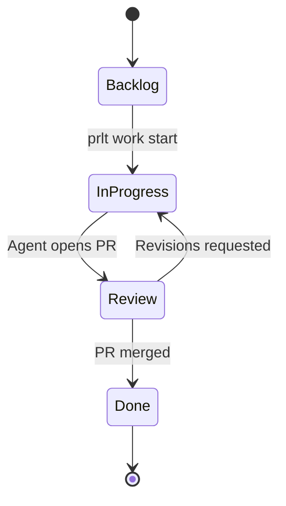

Proletariat uses **tickets**, **epics**, and **specs** to provide structured context to AI agents. Instead of freeform chat, agents receive well-defined work items with requirements, acceptance criteria, and scope hints.

## Tickets

Tickets are individual work items assigned to agents. They contain all the context an agent needs to complete the work.

### Ticket Structure

```typescript
export const pmoTickets = sqliteTable('pmo_tickets', {
  id: text('id').primaryKey(),                    // e.g., "TKT-042"
  projectId: text('project_id').notNull(),
  title: text('title').notNull(),
  description: text('description'),
  priority: text('priority'),                     // P0, P1, P2, P3
  category: text('category'),                     // feature, bug, chore, etc.
  status: text('status').notNull(),
  statusId: text('status_id'),                    // Links to workflow status
  owner: text('owner'),
  assignee: text('assignee'),                     // Agent name
  branch: text('branch'),                         // Git branch for this ticket
  specId: text('spec_id'),                        // Optional linked spec
  epicId: text('epic_id'),                        // Optional parent epic
  labels: text('labels').notNull().default('[]'),
  position: integer('position').notNull().default(0),
  createdAt: text('created_at'),
  updatedAt: text('updated_at'),
})
```

### Creating Tickets

**Interactive:**

```bash
prlt ticket create

? Title: Add OAuth authentication
? Description: Implement Google and GitHub OAuth
? Priority: P1
? Category: feature

✓ Created TKT-042
```

**With flags:**

```bash
prlt ticket create \
  --title "Add OAuth authentication" \
  --description "Implement Google and GitHub OAuth" \
  --priority P1 \
  --category feature
```

**JSON mode:**

```bash
prlt ticket create --json

{
  "prompt": {
    "type": "input",
    "message": "Title:",
    "command": "prlt ticket create --title <input> --json"
  }
}
```

### Ticket Metadata

Tickets can have additional structured data:

#### Subtasks

```typescript
export const pmoSubtasks = sqliteTable('pmo_subtasks', {
  id: text('id').notNull(),
  ticketId: text('ticket_id').notNull(),
  title: text('title').notNull(),
  done: integer('done', { mode: 'boolean' }).default(false),
  position: integer('position').notNull(),
})
```

#### Acceptance Criteria

```typescript
export const pmoTicketAcceptanceCriteria = sqliteTable('pmo_ticket_acceptance_criteria', {
  id: text('id').notNull(),
  ticketId: text('ticket_id').notNull(),
  criterion: text('criterion').notNull(),
  verifiable: integer('verifiable', { mode: 'boolean' }).default(true),
  verified: integer('verified', { mode: 'boolean' }).default(false),
  verifiedAt: text('verified_at'),
  verifiedBy: text('verified_by'),
  position: integer('position').notNull().default(0),
})
```

#### Affected Paths

Scope hints for agents—which files or directories this ticket affects:

```typescript
export const pmoTicketAffectedPaths = sqliteTable('pmo_ticket_affected_paths', {
  id: integer('id').primaryKey({ autoIncrement: true }),
  ticketId: text('ticket_id').notNull(),
  pathPattern: text('path_pattern').notNull(),
  pathType: text('path_type').notNull().default('file'),
  createdAt: text('created_at'),
})
```

Example:

```bash
prlt ticket edit TKT-042 --affected-paths "src/auth/**" "src/oauth/**"
```

### Ticket Dependencies

Tickets can depend on other tickets:

```typescript
export const pmoTicketDependencies = sqliteTable('pmo_ticket_dependencies', {
  ticketId: text('ticket_id').notNull(),
  dependsOnTicketId: text('depends_on_ticket_id').notNull(),
  dependencyType: text('dependency_type').notNull().default('blocks'),
  createdAt: text('created_at'),
})
```

**Link dependencies:**

```bash
prlt ticket link block TKT-042 TKT-041  # TKT-041 blocks TKT-042
prlt ticket link relates TKT-042 TKT-040  # Related tickets
```

### Ticket Lifecycle

Tickets move through workflow statuses as agents work on them:



**Moving tickets:**

```bash
prlt ticket move TKT-042 "In Progress"
```

Agents automatically move tickets when they start work, open PRs, or complete tasks.

## Epics

Epics are collections of related tickets that represent larger features or initiatives.

### Epic Structure

```typescript
export const pmoEpics = sqliteTable('pmo_epics', {
  id: text('id').primaryKey(),              // e.g., "EPIC-001"
  projectId: text('project_id').notNull(),
  title: text('title').notNull(),
  description: text('description'),
  status: text('status').notNull().default('active'),  // active, draft, complete
  position: integer('position').notNull().default(0),
  filePath: text('file_path'),              // Optional markdown file
  specId: text('spec_id'),                  // Optional linked spec
  createdAt: text('created_at'),
  updatedAt: text('updated_at'),
})
```

### Creating Epics

```bash
prlt epic create \
  --title "OAuth Integration" \
  --description "Complete OAuth 2.0 integration with multiple providers"
```

### Adding Tickets to Epics

```bash
prlt epic ticket EPIC-001  # Interactive: select tickets
# or
prlt ticket edit TKT-042 --epic EPIC-001
```

### Epic Dependencies

Epics can block other epics:

```typescript
export const pmoEpicDependencies = sqliteTable('pmo_epic_dependencies', {
  epicId: text('epic_id').notNull(),
  dependsOnEpicId: text('depends_on_epic_id').notNull(),
  dependencyType: text('dependency_type').notNull().default('blocks'),
  createdAt: text('created_at'),
})
```

```bash
prlt epic link block EPIC-002 EPIC-001  # EPIC-001 blocks EPIC-002
```

### Epic Progress

View completion status:

```bash
prlt epic progress EPIC-001

EPIC-001: OAuth Integration
─────────────────────────────
Progress: 3/5 tickets complete (60%)

✓ TKT-041: Setup OAuth providers
✓ TKT-042: Add OAuth routes
✓ TKT-043: Add OAuth UI
○ TKT-044: Add OAuth tests
○ TKT-045: Update documentation
```

## Specs

Specs are static documentation that can span multiple projects. They define requirements, architecture, and design decisions.

### Spec Structure

```typescript
export const pmoSpecs = sqliteTable('pmo_specs', {
  id: text('id').primaryKey(),              // e.g., "SPEC-001"
  title: text('title').notNull(),
  status: text('status').default('draft'),  // draft, approved, deprecated
  type: text('type'),                       // feature, architecture, design, etc.
  tags: text('tags'),                       // JSON array
  problem: text('problem'),
  solution: text('solution'),
  decisions: text('decisions'),
  notNow: text('not_now'),                  // Out of scope
  uiUx: text('ui_ux'),
  acceptanceCriteria: text('acceptance_criteria'),
  openQuestions: text('open_questions'),
  requirementsFunctional: text('requirements_functional'),
  requirementsTechnical: text('requirements_technical'),
  context: text('context'),
  createdAt: text('created_at'),
  updatedAt: text('updated_at'),
})
```

### Creating Specs

```bash
prlt spec create \
  --title "OAuth Architecture" \
  --type architecture \
  --status draft
```

### Linking Specs

**To tickets:**

```bash
prlt spec ticket SPEC-001  # Create tickets from spec
prlt ticket edit TKT-042 --spec SPEC-001  # Link existing ticket
```

**To epics:**

```bash
prlt epic edit EPIC-001 --spec SPEC-001
```

**To other specs:**

```typescript
export const pmoSpecDependencies = sqliteTable('pmo_spec_dependencies', {
  specId: text('spec_id').notNull(),
  dependsOnSpecId: text('depends_on_spec_id').notNull(),
  dependencyType: text('dependency_type').notNull().default('depends_on'),
  createdAt: text('created_at'),
})
```

```bash
prlt spec link relates SPEC-002 SPEC-001
```

### Generating Plans

Use AI to generate implementation plans from specs:

```bash
prlt spec plan SPEC-001

# AI analyzes spec and creates:
# - Epic breakdown
# - Ticket suggestions
# - Acceptance criteria
# - Estimated effort
```

## Ticket Templates

Create reusable ticket templates:

```typescript
export const pmoTicketTemplates = sqliteTable('pmo_ticket_templates', {
  id: text('id').primaryKey(),
  name: text('name').notNull().unique(),
  description: text('description'),
  isBuiltin: integer('is_builtin', { mode: 'boolean' }).notNull().default(false),
  titlePattern: text('title_pattern'),
  descriptionTemplate: text('description_template'),
  defaultPriority: text('default_priority'),
  defaultCategory: text('default_category'),
  defaultStatusId: text('default_status_id'),
  defaultLabels: text('default_labels').notNull().default('[]'),
  suggestedSubtasks: text('suggested_subtasks').notNull().default('[]'),
  createdAt: text('created_at'),
})
```

**Save template:**

```bash
prlt ticket template save TKT-042 "OAuth Ticket Template"
```

**Apply template:**

```bash
prlt template ticket apply "OAuth Ticket Template"
```

## Labels and Categories

### Categories

Built-in ticket and status classifications:

```typescript
export const pmoCategories = sqliteTable('pmo_categories', {
  id: text('id').primaryKey(),
  name: text('name').notNull(),
  type: text('type').notNull(),              // ticket_category, status_category
  description: text('description'),
  color: text('color'),
  position: integer('position').notNull().default(0),
  isBuiltin: integer('is_builtin', { mode: 'boolean' }).notNull().default(false),
  createdAt: text('created_at'),
})
```

Common categories: `feature`, `bug`, `chore`, `docs`, `test`, `refactor`

### Labels

Flexible tagging system:

```typescript
export const pmoLabels = sqliteTable('pmo_labels', {
  id: text('id').primaryKey(),
  name: text('name').notNull(),
  color: text('color'),
  description: text('description'),
  groupId: text('group_id'),                 // Optional label group
  position: integer('position').notNull().default(0),
  isBuiltin: integer('is_builtin', { mode: 'boolean' }).notNull().default(false),
  createdAt: text('created_at'),
})
```

**Label groups** organize related labels:

```typescript
export const pmoLabelGroups = sqliteTable('pmo_label_groups', {
  id: text('id').primaryKey(),
  name: text('name').notNull().unique(),
  description: text('description'),
  isExclusive: integer('is_exclusive', { mode: 'boolean' }).notNull().default(false),  // Only one per ticket
  isRequired: integer('is_required', { mode: 'boolean' }).notNull().default(false),    // Must have one
  position: integer('position').notNull().default(0),
  createdAt: text('created_at'),
})
```

## Key Patterns

### Structured Context

Agents receive tickets with:

- **Title & Description**: What to do
- **Acceptance Criteria**: Definition of done
- **Affected Paths**: Where to look
- **Subtasks**: Step-by-step breakdown
- **Dependencies**: Blocking work
- **Spec Links**: Detailed requirements

This gives agents clear, unambiguous instructions.

### Persistent Context

Tickets accumulate context over time:

- Agent makes progress, commits, opens PR
- Reviewer requests changes, adds comments
- Ticket status moves to "In Progress"
- New agent picks up the ticket, sees all history

Context persists across multiple agent runs.

### Ticket-Driven Workflow

```bash
# Create ticket
prlt ticket create --title "Add OAuth" --category feature

# Spawn agent
prlt work start TKT-042

# Agent reads ticket, writes code, opens PR
# Ticket automatically moves to "Review"

# Merge PR
prlt work complete TKT-042
# Ticket moves to "Done"
```

## Summary

<CardGroup cols={2}>
  <Card title="Tickets" icon="ticket">
    Individual work items with requirements and acceptance criteria
  </Card>
  
  <Card title="Epics" icon="layer-group">
    Collections of related tickets for larger features
  </Card>
  
  <Card title="Specs" icon="file-lines">
    Static documentation with architecture and design decisions
  </Card>
  
  <Card title="Dependencies" icon="link">
    Tickets, epics, and specs can depend on each other
  </Card>
  
  <Card title="Templates" icon="clone">
    Reusable ticket patterns for common work types
  </Card>
  
  <Card title="Labels & Categories" icon="tags">
    Flexible tagging and classification system
  </Card>
</CardGroup>

## Next Steps

- [Agents](/concepts/agents) - Staff vs temp agents and themes
- [Workflows](/concepts/workflows) - Customize ticket status flows
- [Execution Modes](/concepts/execution-modes) - Run agents in Docker or host mode
