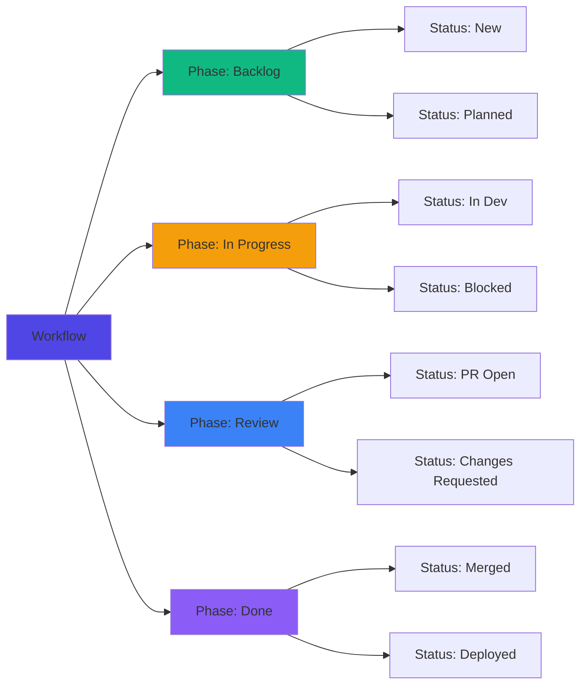
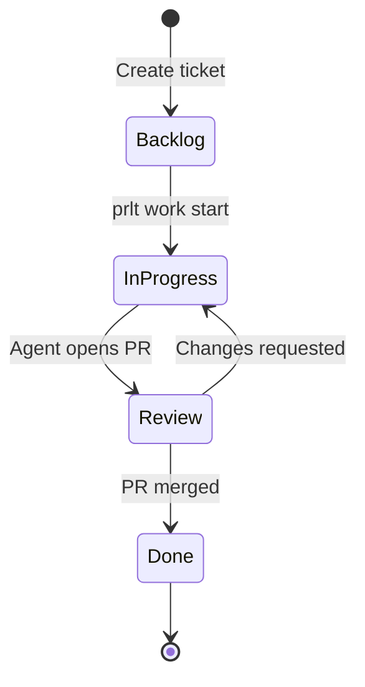

Workflows define how tickets move through your development process. Proletariat supports flexible, customizable workflows that can be shared across projects.

## Workflow Concepts



### Key Components

- **Workflow**: A named configuration (e.g., "Kanban", "Scrum")
- **Phase**: High-level stage (e.g., "Backlog", "In Progress")
- **Status**: Specific state within a phase (e.g., "PR Open", "Blocked")
- **Category**: Status classification (e.g., "todo", "in_progress", "done")

## Workflow Schema

### Workflows

```typescript
export const pmoWorkflows = sqliteTable('pmo_workflows', {
  id: text('id').primaryKey(),
  name: text('name').notNull().unique(),
  description: text('description'),
  isBuiltin: integer('is_builtin', { mode: 'boolean' }).notNull().default(false),
  createdAt: text('created_at'),
  updatedAt: text('updated_at'),
})
```

### Workflow Statuses

```typescript
export const pmoWorkflowStatuses = sqliteTable('pmo_workflow_statuses', {
  id: text('id').primaryKey(),
  workflowId: text('workflow_id').notNull(),
  name: text('name').notNull(),
  category: text('category').notNull(),           // todo, in_progress, review, done
  position: integer('position').notNull().default(0),
  color: text('color'),
  description: text('description'),
  isDefault: integer('is_default', { mode: 'boolean' }).notNull().default(false),
  createdAt: text('created_at'),
})
```

### Phases (Optional)

Phases group statuses at a higher level:

```typescript
export const pmoPhases = sqliteTable('pmo_phases', {
  id: text('id').primaryKey(),
  name: text('name').notNull().unique(),
  category: text('category').notNull(),
  position: integer('position').notNull().default(0),
  color: text('color'),
  description: text('description'),
  isDefault: integer('is_default', { mode: 'boolean' }).notNull().default(false),
  createdAt: text('created_at'),
})
```

<Note>
Phases are workspace-scoped and optional. Workflows use statuses, and projects can reference phases for high-level tracking.
</Note>

## Built-in Workflows

### Kanban (Default)

Simple, continuous flow:

```
Kanban Workflow
├── Backlog        (category: todo)
├── In Progress    (category: in_progress)
├── Review         (category: review)
└── Done           (category: done)
```

### Scrum

Sprint-based workflow:

```
Scrum Workflow
├── Backlog        (category: todo)
├── Sprint
│   ├── To Do      (category: todo)
│   ├── In Progress (category: in_progress)
│   └── In Review  (category: review)
└── Done           (category: done)
```

### Custom

Define your own:

```
Custom Workflow
├── Triage         (category: todo)
├── Design         (category: in_progress)
├── Development    (category: in_progress)
├── Testing        (category: review)
├── Staging        (category: review)
└── Production     (category: done)
```

## Workflow Commands

### List Workflows

```bash
prlt workflow list

Workflows:
  kanban       Kanban workflow (default)
  scrum        Scrum workflow
  custom       Custom workflow
```

### View Workflow

```bash
prlt workflow view kanban

Workflow: Kanban
Description: Simple kanban workflow

Statuses:
  Backlog       (todo)         Position: 0   Default: Yes
  In Progress   (in_progress)  Position: 1
  Review        (review)       Position: 2
  Done          (done)         Position: 3
```

### Create Workflow

```bash
prlt workflow create \
  --name "Custom" \
  --description "My custom workflow"

# Then add statuses
prlt status create \
  --workflow custom \
  --name "Triage" \
  --category todo \
  --position 0

prlt status create \
  --workflow custom \
  --name "Design" \
  --category in_progress \
  --position 1
```

### Switch Workflow

Projects reference workflows:

```bash
prlt workflow switch scrum

# Now new projects use the Scrum workflow by default
```

### Delete Workflow

```bash
prlt workflow delete custom

# Cannot delete built-in workflows
# Cannot delete if projects are using it
```

## Status Categories

Statuses are grouped into semantic categories:

| Category | Meaning | Typical Statuses |
|----------|---------|------------------|
| `todo` | Not started | Backlog, New, Planned, To Do |
| `in_progress` | Being worked on | In Progress, Development, Blocked |
| `review` | Awaiting review | Review, PR Open, QA, Staging |
| `done` | Complete | Done, Merged, Deployed, Closed |

Categories help with:

- Board visualization
- Progress tracking
- Epic completion calculations
- Workflow automation

## Status Management

### List Statuses

```bash
prlt status list

Statuses (Kanban workflow):
  Backlog       (todo)         Position: 0   Default
  In Progress   (in_progress)  Position: 1
  Review        (review)       Position: 2
  Done          (done)         Position: 3
```

### Create Status

```bash
prlt status create \
  --name "Blocked" \
  --category in_progress \
  --color "#EF4444" \
  --description "Work blocked by dependency" \
  --position 2
```

### Update Status

```bash
prlt status update blocked \
  --name "Waiting" \
  --description "Waiting on external dependency"
```

### Reorder Statuses

```bash
prlt status move blocked --position 3

# Shifts other statuses automatically
```

### Delete Status

```bash
prlt status delete blocked

# Fails if tickets are in this status
# Move tickets first: prlt ticket move TKT-042 "In Progress"
```

## Projects and Workflows

Projects reference a workflow:

```typescript
export const pmoProjects = sqliteTable('pmo_projects', {
  id: text('id').primaryKey(),
  name: text('name').notNull(),
  workflowId: text('workflow_id'),              // References workflow
  phaseId: text('phase_id'),                    // Optional phase
  // ...
})
```

**Create project with workflow:**

```bash
prlt project create \
  --name "Mobile App" \
  --workflow scrum
```

**Switch project workflow:**

```bash
prlt project edit mobile-app --workflow kanban

# All tickets in project now use Kanban statuses
```

<Warning>
Changing a project's workflow moves tickets to the default status of the new workflow. Map statuses carefully.
</Warning>

## Ticket Status Flow

Tickets move through statuses as work progresses:



### Moving Tickets

**Manual:**

```bash
prlt ticket move TKT-042 "In Progress"
```

**Automatic:**

Agents move tickets automatically:

- `prlt work start TKT-042` → moves to "In Progress"
- Agent opens PR → moves to "Review"
- `prlt work complete TKT-042` → moves to "Done"

## Board Views

Board views provide filtered, customized ticket displays:

```typescript
export const pmoBoardViews = sqliteTable('pmo_board_views', {
  id: text('id').primaryKey(),
  projectId: text('project_id').notNull(),
  name: text('name').notNull(),
  description: text('description'),
  isDefault: integer('is_default', { mode: 'boolean' }).notNull().default(false),
  filters: text('filters').notNull().default('{}'),  // JSON
  groupBy: text('group_by'),
  sortBy: text('sort_by'),
  createdAt: text('created_at'),
  updatedAt: text('updated_at'),
})
```

**View board:**

```bash
prlt board

┌────────────┬────────────────┬────────────┬──────┐
│ Backlog    │ In Progress    │ Review     │ Done │
├────────────┼────────────────┼────────────┼──────┤
│ TKT-045    │ TKT-042        │ TKT-041    │ TKT-040 │
│ TKT-046    │ TKT-043        │            │         │
│ TKT-047    │ TKT-044        │            │         │
└────────────┴────────────────┴────────────┴──────┘
```

**Watch board (real-time):**

```bash
prlt board watch

# Updates in real-time as tickets move
```

## Phase Templates

Phase templates define preset phase configurations:

```typescript
export const pmoPhaseTemplates = sqliteTable('pmo_phase_templates', {
  id: text('id').primaryKey(),
  name: text('name').notNull().unique(),
  description: text('description'),
  isBuiltin: integer('is_builtin', { mode: 'boolean' }).notNull().default(false),
  phases: text('phases').notNull(),             // JSON array of phase definitions
  createdAt: text('created_at'),
})
```

**List templates:**

```bash
prlt template phase list

Phase Templates:
  software-dev    Software development lifecycle
  product         Product development phases
```

**Apply template:**

```bash
prlt phase create --from-template software-dev

# Creates:
# - Discovery
# - Design
# - Development
# - Testing
# - Deployment
```

## Workflow Automation

### Watch Mode

Automatically spawn agents for tickets in a status:

```bash
prlt work watch --column "Ready"

# Monitors "Ready" status
# Spawns agents for new tickets
# Moves tickets to "In Progress" automatically
```

### Batch Operations

Move multiple tickets at once:

```bash
prlt ticket bulk move \
  --from "Backlog" \
  --to "Sprint" \
  --priority P0 P1

# Moves all P0 and P1 tickets from Backlog to Sprint
```

## MCP Tools

Workflows are exposed through MCP for AI agent integration:

```typescript
// From mcp/tools/workflow.ts

strictTool(server, 'workflow_list', ...)
strictTool(server, 'workflow_show', ...)
strictTool(server, 'workflow_create', ...)
strictTool(server, 'workflow_delete', ...)
```

**Use in AI agents:**

```json
{
  "name": "workflow_list",
  "arguments": {
    "include_builtin": true
  }
}
```

## Key Patterns

### Shared Workflows

Multiple projects can share the same workflow:

```bash
# Create workflow once
prlt workflow create --name "Engineering"

# Use in multiple projects
prlt project create --name "Frontend" --workflow engineering
prlt project create --name "Backend" --workflow engineering
prlt project create --name "API" --workflow engineering
```

Changes to the workflow affect all projects using it.

### Status Position

Statuses are ordered by `position`:

```sql
SELECT * FROM pmo_workflow_statuses
WHERE workflow_id = 'kanban'
ORDER BY position
```

Board columns display in position order.

### Default Status

Each workflow has one default status:

```typescript
const defaultStatus = await db
  .select()
  .from(pmoWorkflowStatuses)
  .where(
    and(
      eq(pmoWorkflowStatuses.workflowId, workflowId),
      eq(pmoWorkflowStatuses.isDefault, true)
    )
  )
  .get()
```

New tickets start in the default status.

### Category-Based Queries

Query tickets by status category:

```sql
-- All tickets in progress
SELECT t.* FROM pmo_tickets t
JOIN pmo_workflow_statuses s ON t.status_id = s.id
WHERE s.category = 'in_progress'

-- Calculate epic completion
SELECT 
  COUNT(*) FILTER (WHERE s.category = 'done') * 100.0 / COUNT(*) as completion
FROM pmo_tickets t
JOIN pmo_workflow_statuses s ON t.status_id = s.id
WHERE t.epic_id = 'EPIC-001'
```

## Summary

<CardGroup cols={2}>
  <Card title="Workflows" icon="diagram-project">
    Named configurations with customizable status flows
  </Card>
  
  <Card title="Statuses" icon="list-check">
    Specific states within a workflow (Backlog, In Progress, etc.)
  </Card>
  
  <Card title="Categories" icon="tags">
    Semantic groupings (todo, in_progress, review, done)
  </Card>
  
  <Card title="Phases" icon="layer-group">
    Optional high-level stages for project lifecycle
  </Card>
  
  <Card title="Board Views" icon="table">
    Filtered, customized ticket displays
  </Card>
  
  <Card title="Automation" icon="robot">
    Watch mode and batch operations for efficiency
  </Card>
</CardGroup>

## Next Steps

- [Tickets & Epics](/concepts/tickets) - Structure work items
- [Agents](/concepts/agents) - Staff vs temp agents
- [Execution Modes](/concepts/execution-modes) - Run agents safely and efficiently
