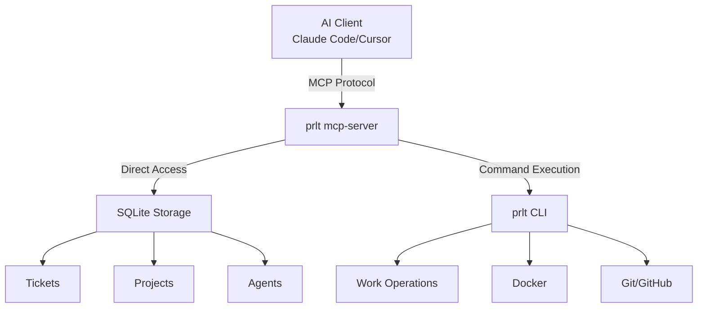

## What is the MCP Server?

Proletariat CLI includes a built-in **Model Context Protocol (MCP) server** that exposes all `prlt` commands as structured tools for AI agents. This allows AI coding assistants like Claude Code, Cursor, and other MCP-compatible clients to directly interact with your project management system, spawn agents, manage tickets, and coordinate multi-agent workflows.

<Info>
  The MCP server provides **140+ tools** covering all aspects of the Proletariat platform - from ticket management to agent orchestration.
</Info>

## Key Features

- **Complete CLI Coverage**: Every `prlt` command is available as an MCP tool
- **Structured Outputs**: All responses are JSON-formatted for reliable parsing
- **Workspace Awareness**: Automatically detects workspace context and execution state
- **PMO Integration**: Direct access to SQLite storage for fast ticket/project queries
- **Command Execution**: Run arbitrary `prlt` commands via passthrough tools

## Available Tool Categories

The MCP server organizes tools into logical groups:

### Core Project Management
- **Tickets** (15+ tools): Create, list, edit, move, link, and bulk operations
- **Projects** (8+ tools): Project lifecycle, archiving, and view management
- **Epics** (12+ tools): Epic creation, progress tracking, and ticket linking
- **Specs** (8+ tools): Specification management and planning
- **Board** (6+ tools): Kanban board views and status filtering

### Workflow & Organization
- **Workflows** (7+ tools): Workflow creation and phase management
- **Statuses** (7+ tools): Custom status definitions and ordering
- **Phases** (6+ tools): Phase lifecycle and transitions
- **Categories** (5+ tools): Ticket categorization
- **Labels** (8+ tools): Label management and grouping
- **Templates** (6+ tools): Ticket and phase templates

### Agent Operations
- **Work** (12+ tools): Spawn agents, track executions, manage work lifecycle
- **Agents** (8+ tools): Staff and temp agent management
- **Executions** (5+ tools): Monitor running agents, view logs, stop executions
- **Tmux** (4+ tools): Session management and attachment

### Infrastructure
- **Docker** (7+ tools): Container lifecycle and status
- **Repository** (6+ tools): Add/remove repos, view repo details
- **Branch** (4+ tools): Branch creation and validation
- **GitHub** (5+ tools): Authentication, PR operations

### Utilities
- **Actions** (8+ tools): Reusable action templates
- **Roadmap** (4+ tools): High-level planning views
- **View** (3+ tools): Custom view configurations
- **Diet** (4+ tools): Compact data views
- **Init** (3+ tools): Workspace initialization
- **Utility** (4+ tools): Context queries, commit helpers

## How It Works

<Steps>
  <Step title="Server Initialization">
    When you configure the MCP server in your AI client, it starts a persistent process running `prlt mcp-server`.
  </Step>
  
  <Step title="Context Detection">
    The server automatically detects:
    - PMO workspace location (if running inside a workspace)
    - Available repositories
    - Running executions and agents
    - Current user context
  </Step>
  
  <Step title="Tool Registration">
    All 140+ tools are registered with the Model Context Protocol SDK, each with:
    - Structured input schemas (Zod validation)
    - Type-safe parameters
    - JSON response formats
  </Step>
  
  <Step title="Command Execution">
    When an AI agent calls a tool:
    - Direct storage operations for fast queries (tickets, projects, etc.)
    - CLI passthrough for complex operations (agent spawning, Docker management)
    - Workspace-aware execution with proper error handling
  </Step>
</Steps>

## Architecture



## Use Cases

### Autonomous Agent Coordination

AI assistants can spawn and monitor multiple parallel agents:

```typescript
// AI can call these tools directly
await client.callTool('ticket_list', { category: 'bug', priority: 'P1' })
await client.callTool('work_spawn_batch', { ticket_ids: ['TKT-001', 'TKT-002'] })
await client.callTool('execution_list', { status: 'running' })
```

### Intelligent Ticket Grooming

Assistants can analyze tickets and suggest improvements:

```typescript
// Fetch all tickets needing grooming
const tickets = await client.callTool('ticket_list', { column: 'Backlog' })

// For each ticket, analyze and update
for (const ticket of tickets) {
  const details = await client.callTool('ticket_show', { id: ticket.id })
  // AI analyzes and suggests acceptance criteria
  await client.callTool('ticket_update', { 
    id: ticket.id, 
    acceptance_criteria: [...generated]
  })
}
```

### Real-time Board Management

Query board state and make decisions:

```typescript
// Check what's in progress
const board = await client.callTool('board_view', { format: 'json' })

// Move tickets based on status
if (board.review.length > 5) {
  // Too many in review, don't spawn more
} else {
  await client.callTool('work_spawn', { ticket_id: 'TKT-042' })
}
```

## Official Listing

<CardGroup cols={2}>
  <Card title="MCP Registry" icon="book-open" href="https://registry.modelcontextprotocol.io">
    Listed in the official Model Context Protocol registry
  </Card>
  
  <Card title="npm Package" icon="npm" href="https://www.npmjs.com/package/@proletariat/cli">
    Published as `@proletariat/cli` on npm
  </Card>
</CardGroup>

## Next Steps

<CardGroup cols={2}>
  <Card title="Setup Guide" icon="gear" href="/mcp/setup">
    Configure the MCP server in your AI client
  </Card>
  
  <Card title="Tool Reference" icon="wrench" href="/mcp/tools">
    Browse all 140+ available tools and their parameters
  </Card>
</CardGroup>